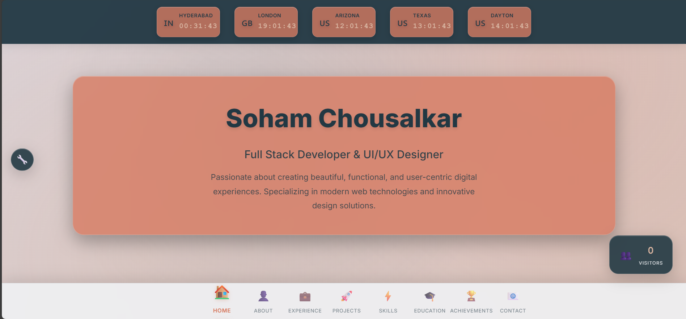
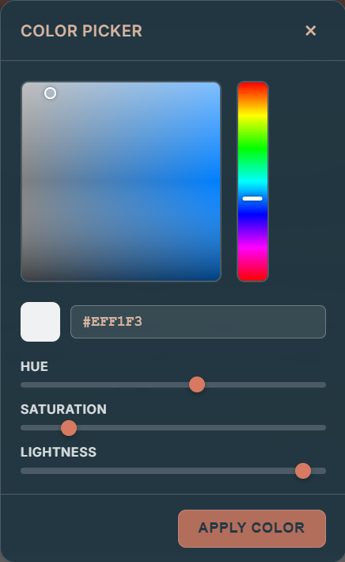

# 🌟 Liquid Glass Portfolio - Soham Chousalkar

A modern, responsive portfolio website featuring liquid glass effects, real-time visitor tracking, and an advanced color customizer.

## 🚀 Live Demo
**[View Live Portfolio](https://soham-chousalkar.github.io/Portfolio/)**

## ✨ Features

### 🎨 **Liquid Glass Design**
- Frosted glass panels with backdrop blur effects
- Subtle shimmer animations and depth
- Responsive design with smooth transitions

### 🌍 **World Clock**
- Real-time display for 5 timezones:
  - 🇮🇳 Hyderabad (IST)
  - 🇬🇧 London (GMT/BST)
  - 🇺🇸 Arizona (MST)
  - 🇺🇸 Texas (CST)
  - 🇺🇸 Dayton (EST)

### 🎛️ **Advanced Customizer Tool**
- **Depth/Intensity Slider:** Control blur and shadow effects
- **Color Palette Picker:** 6 individual color controls
- **Real-time Preview:** Canvas-based color selection
- **HSL/Hex Input:** Multiple color input methods
- **Smart Text Inversion:** Automatic contrast adjustment

### 📊 **Visitor Analytics**
- Real-time visitor counter
- Geographic location tracking
- Interactive charts and statistics
- Auto-refresh every 30 seconds

### 📱 **Responsive Design**
- Mobile-first approach
- Smooth animations
- Touch-friendly interactions
- Cross-browser compatibility

## 🛠️ Technologies Used

- **Frontend:** HTML5, CSS3, JavaScript (ES6+)
- **Build Tool:** Vite
- **Styling:** Custom CSS with liquid glass effects
- **Backend:** Node.js, Express.js
- **Deployment:** GitHub Pages with GitHub Actions

## 📸 Screenshots

### 🏠 Home Section

*Main portfolio landing page with liquid glass effects*

### 🎨 Customizer Tool

*Advanced color customization panel with depth controls*

### 🌈 Color Picker

*Canvas-based color selection with HSL controls*

### 📊 Visitor Analytics

*Real-time visitor tracking with geographic data*

## 🚀 Getting Started

### Prerequisites
- Node.js (v18 or higher)
- npm or yarn

### Installation
```bash
# Clone the repository
git clone https://github.com/Soham-Chousalkar/Portfolio.git

# Navigate to the project directory
cd Portfolio

# Switch to the liquid glass branch
git checkout liquid-glass-portfolio

# Install dependencies
npm install

# Start development server
npm run dev

# Build for production
npm run build

# Start backend server (for visitor tracking)
npm run server
```

## 🎯 Key Features Explained

### **Liquid Glass Effects**
- `backdrop-filter: blur()` for frosted glass appearance
- `rgba()` backgrounds for transparency
- Subtle box-shadows for depth
- Animated background patterns

### **Color Customizer**
- Individual color controls for each UI element
- Real-time HSL to Hex conversion
- Canvas-based color picker
- Automatic text color inversion for contrast

### **World Clock**
- JavaScript Date object manipulation
- Manual timezone offset calculations
- Real-time updates every second
- Responsive design for mobile

### **Visitor Tracking**
- Express.js backend API
- JSON file storage for development
- Geographic location simulation
- Interactive charts with Canvas API

## 📁 Project Structure
```
Portfolio/
├── index.html              # Main HTML file
├── styles.css              # Liquid glass styling
├── main.js                 # Frontend functionality
├── scripts/                # JavaScript utilities
│   ├── visitor-counter.js  # Visitor tracking
│   ├── deployment-status.js # Status checker
│   └── deploy.sh          # Deployment script
├── tools/                  # Development tools
│   ├── check-deployment.md # Deployment guide
│   └── tatus              # Status file
├── assets/                 # Static assets
│   ├── data/              # JSON data files
│   │   ├── visits.json    # Visit data
│   │   └── visitors.json  # Visitor data
│   └── images/            # Images and screenshots
│       ├── home.png       # Home screenshot
│       ├── customize.png  # Customizer screenshot
│       ├── Color-wheel.png # Color picker screenshot
│       ├── visitors.png   # Visitor analytics screenshot
│       └── Soham_Resume.pdf # Resume
├── server.js               # Backend API
├── dist/                   # Built files
└── .github/workflows/      # GitHub Actions
```

## 🌐 Deployment

### GitHub Pages
- Automatic deployment via GitHub Actions
- Built files served from `gh-pages` branch
- Live at: https://soham-chousalkar.github.io/Portfolio/

### Local Development
```bash
# Development server
npm run dev

# Production build
npm run build

# Preview build
npm run preview
```

## 🎨 Customization

### Color Palette
The portfolio uses a sophisticated color palette:
- **Background:** `#dbd3d8` (Light gray-beige)
- **Navigation:** `#eff1f3` (Off-white)
- **Text:** `#223843` (Dark blue-gray)
- **Panels:** `#d77a61` (Warm coral)
- **Accent:** `#d8b4a0` (Peach)

### Adding New Features
1. **New Sections:** Add to `index.html` and `styles.css`
2. **Animations:** Use CSS keyframes and transitions
3. **Interactive Elements:** Extend `main.js` functionality
4. **Styling:** Follow liquid glass design principles

## 🤝 Contributing

1. Fork the repository
2. Create a feature branch (`git checkout -b feature/AmazingFeature`)
3. Commit your changes (`git commit -m 'Add some AmazingFeature'`)
4. Push to the branch (`git push origin feature/AmazingFeature`)
5. Open a Pull Request

## 📄 License

This project is licensed under the MIT License - see the [LICENSE](LICENSE) file for details.

## 👨‍💻 Author

**Soham Chousalkar**
- Full Stack Developer & UI/UX Designer
- Specializing in modern web technologies
- Creating beautiful, functional digital experiences

## 🌟 Acknowledgments

- **Liquid Glass Design:** Inspired by modern glassmorphism trends
- **Color Theory:** Advanced color picker with accessibility in mind
- **Real-time Features:** World clock and visitor tracking for engagement
- **Responsive Design:** Mobile-first approach for all devices

---

**⭐ Star this repository if you find it helpful!** 