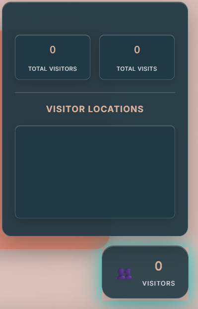
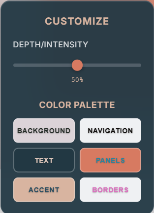

# 🌟 Liquid Glass Portfolio

A modern, responsive portfolio website featuring liquid glass effects, real-time visitor tracking, and an advanced color customizer.

## 🚀 Live Demo
**[View Live Portfolio](https://soham-chousalkar.github.io/Portfolio/)**

## 📸 Portfolio Showcase

### 🏠 Home Page
<div align="center">
  
</div>

---

### 📊 Visitor Analytics
<div style="display: flex; align-items: center; gap: 2rem;">
  <div style="flex: 1;">
    
  </div>
  <div style="flex: 1;">
    <h3>Real-Time Visitor Tracking</h3>
    <p>Track visitors from around the world with geographic location data, visit counts, and interactive analytics. The system automatically updates every 30 seconds and provides detailed insights into your portfolio's reach.</p>
    <ul>
      <li>🌍 Geographic location tracking</li>
      <li>📈 Real-time visit statistics</li>
      <li>🔄 Auto-refresh every 30 seconds</li>
      <li>📊 Interactive charts and data</li>
    </ul>
  </div>
</div>

---

### 🎨 Customizer Tool
<div style="display: flex; align-items: center; gap: 2rem;">
  <div style="flex: 1;">
    <h3>Advanced Color Customization</h3>
    <p>Take full control of your portfolio's appearance with our sophisticated customizer tool. Adjust depth, intensity, and every color element in real-time with instant visual feedback.</p>
    <ul>
      <li>🎛️ Depth/Intensity slider control</li>
      <li>🎨 6 individual color controls</li>
      <li>⚡ Real-time preview updates</li>
      <li>🎯 Smart text inversion for contrast</li>
    </ul>
  </div>
  <div style="flex: 1;">
    
  </div>
</div>

---

### 🌈 Color Picker
<div style="display: flex; align-items: center; gap: 2rem;">
  <div style="flex: 1;">
    
  </div>
  <div style="flex: 1;">
    <h3>Professional Color Selection</h3>
    <p>Experience the most advanced color picker with canvas-based selection, HSL controls, and hex input. Perfect for designers and developers who demand precision in their color choices.</p>
    <ul>
      <li>🎨 Canvas-based color selection</li>
      <li>🌈 HSL slider controls</li>
      <li>🔢 Hex code input support</li>
      <li>✨ Instant color preview</li>
    </ul>
  </div>
</div>

---

## ✨ Key Features

### 🌍 **World Clock**
Real-time display for 5 timezones: 🇮🇳 Hyderabad, 🇬🇧 London, 🇺🇸 Arizona, 🇺🇸 Texas, 🇺🇸 Dayton

### 🎛️ **Advanced Customizer**
- Depth/Intensity slider for blur effects
- 6 individual color controls
- Real-time preview with instant feedback
- Smart text inversion for optimal contrast

### 📊 **Visitor Analytics**
- Real-time visitor counter
- Geographic location tracking
- Interactive charts and statistics
- Auto-refresh every 30 seconds

## 🛠️ Technologies

- **Frontend:** HTML5, CSS3, JavaScript (ES6+)
- **Build Tool:** Vite
- **Styling:** Custom CSS with liquid glass effects
- **Backend:** Node.js, Express.js
- **Deployment:** GitHub Pages with GitHub Actions

## 🚀 Quick Start

```bash
# Clone and setup
git clone https://github.com/Soham-Chousalkar/Portfolio.git
cd Portfolio
git checkout liquid-glass-portfolio
npm install

# Development
npm run dev

# Production build
npm run build

# Start backend (for visitor tracking)
npm run server
```

## 📁 Project Structure

```
Portfolio/
├── index.html              # Main HTML file
├── src/
│   ├── components/         # JavaScript components
│   │   └── main.js        # Frontend functionality
│   ├── styles/            # CSS styling
│   │   └── styles.css     # Liquid glass styling
│   ├── utils/             # Utility scripts
│   │   ├── visitor-counter.js  # Visitor tracking
│   │   ├── server.js      # Backend API
│   │   ├── deployment-status.js # Status checker
│   │   ├── deploy.sh      # Deployment script
│   │   ├── check-deployment.md # Deployment guide
│   │   └── tatus          # Status file
│   └── assets/            # Static assets
│       ├── data/          # JSON data files
│       │   ├── visits.json    # Visit data
│       │   └── visitors.json  # Visitor data
│       └── images/        # Images and screenshots
│           ├── home.png       # Home screenshot
│           ├── customize.png  # Customizer screenshot
│           ├── Color-wheel.png # Color picker screenshot
│           ├── visitors.png   # Visitor analytics screenshot
│           └── Soham_Resume.pdf # Resume
├── dist/                   # Built files
└── .github/workflows/      # GitHub Actions
```

## 🎨 Color Palette

- **Background:** `#dbd3d8` (Light gray-beige)
- **Navigation:** `#eff1f3` (Off-white)
- **Text:** `#223843` (Dark blue-gray)
- **Panels:** `#d77a61` (Warm coral)
- **Accent:** `#d8b4a0` (Peach)

## 🌐 Deployment

- **Live URL:** https://soham-chousalkar.github.io/Portfolio/
- **Automatic deployment** via GitHub Actions
- **Built files** served from `gh-pages` branch

## 👨‍💻 Author

**Soham Chousalkar**
- Full Stack Developer & UI/UX Designer
- Specializing in modern web technologies
- Creating beautiful, functional digital experiences

---

**⭐ Star this repository if you find it helpful!** 